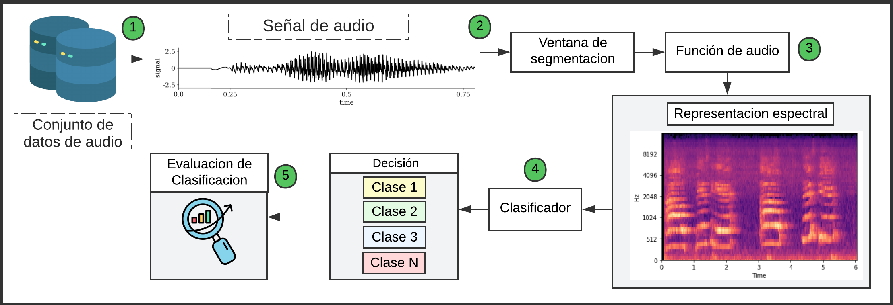

##  :sound:  Clasificación de sonidos ambientales utilizando representaciones tiempo - frecuencia

Este es un proyecto de investigación en el área del procesamiento de señales digitales, enfocado en el analisis de las señales no-estacionarias abordadas desde la representación tiempo-frecuencia, además considerando la variación  de los parametros en la creación de imagenes basadas en la `Short Time Fourier Transform ` y la `Continous Walavet Transform`.

Como fuente principal para la extracción de los datos se utiliza el conjunto de datos **UbanSound8k**, que soportan los datos y resultados obtenidos del análisis previo al tratamiento de los segmentos de audio.
> Información de dataset :  [UrbanSound8K](https://urbansounddataset.weebly.com/urbansound8k.html)

<h1 align="center"> Esquema general del proceso de clasificacion </h1>

 

## Tabla de contenidos:
---
- [Contexto de la clasificación de sonidos del entorno](#contexto-de-la-clasificación-de-sonidos-del-entorno)  
- [1. Procesamiento de datos](#procesamiento-de-datos)  
- [2. Extracción de características](#extracción-de-características)  
  - [2.1. Características artesanales](#características-artesanales)  
  - [2.2. Representaciones basadas en STFT y CWT](#representaciones-basadas-en-stft-y-cwt)  
- [3. Modelos de clasificación](#modelos-de-clasificación)  
  - [3.1. Redes neuronales convolucionales (CNN)](#redes-neuronales-convolucionales-cnn)  
- [4. Documento académico y resultados](#documento-académico-y-resultados)  

## Contexto de la clasificación de sonidos del entorno
El rápido crecimiento de las zonas urbanas a nivel mundial ha impulsado una notable diversificación de los paisajes sonoros, conformados por tres elementos principales: sonidos naturales, artificiales y antropogénicos. Estos sonidos, lejos de ser simples manifestaciones del entorno, pueden convertirse en valiosa información para comprender el comportamiento y los patrones que emergen en espacios urbanos, como zonas de tránsito vehicular, parques o áreas de recreación.

El tratamiento de señales de audio no estacionarias, características de este tipo de entornos, requiere el uso de métodos especializados para su procesamiento y clasificación objetiva, considerando la complejidad y variabilidad de sus propiedades acústicas.

En este proyecto se plantea evaluar el proceso de clasificación de sonidos ambientales mediante el uso de representaciones visuales adaptadas a un clasificador basado en redes neuronales convolucionales (CNN). Para garantizar un alto grado de confiabilidad, se aplicarán técnicas de procesamiento digital de señales, permitiendo la extracción de características artesanales de las diferentes clases de sonidos y asociando sus atributos acústicos a las decisiones generadas por el clasificador CNN.

Por último, se reflejan los resultados de la eficiencia computacional  de utilizar  cada una de las representaciones tipo espectrograma o escalograma respecto a los modelos `VGG16`  y `Resnet101` considerando que conjunto de recursos presenta ser el más precisó y óptimo para realizar un proceso de clasificación satisfactorio.

## Procesamiento de datos
Aquí va el contenido sobre el procesamiento de datos.

## Extracción de características
Aquí va la información general sobre la extracción de características.

### Características artesanales
Aquí va el contenido sobre características artesanales.

### Representaciones basadas en STFT y CWT
Aquí va el contenido sobre representaciones basadas en STFT y CWT.

## Modelos de clasificación
Aquí va la información general sobre modelos de clasificación.

### Redes neuronales convolucionales (CNN)
Aquí va el contenido sobre el uso de CNN en la clasificación de sonidos.

## Documento académico y resultados
Aquí va el contenido sobre la documentación académica y los resultados obtenidos.

## Clasificacion de sonidos del entorno
