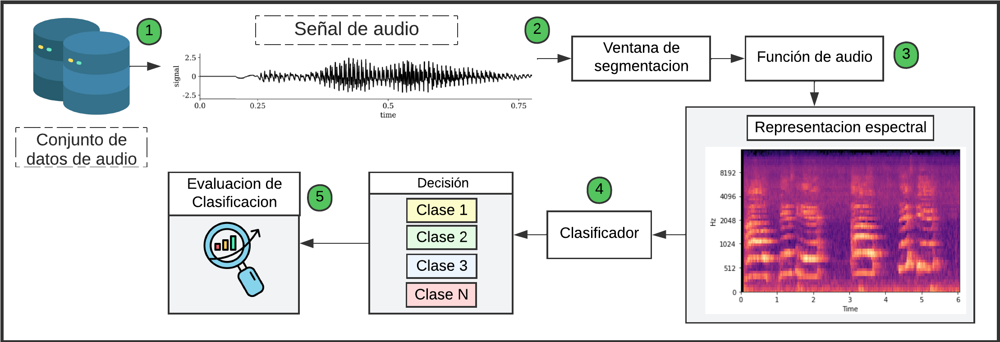

##  :sound:  Clasificación de sonidos ambientales utilizando representaciones tiempo - frecuencia
   

   
   

Este es un proyecto de investigación en el área del procesamiento de señales digitales, enfocado en el analisis de las señales no-estacionarias abordadas desde la representación tiempo-frecuencia, además considerando la variación  de los parametros en la creación de imagenes basadas en la `Short Time Fourier Transform ` y la `Continous Walavet Transform`.

Como fuente principal para la extracción de los datos se utiliza el conjunto de datos **UbanSound8k**, que soportan los datos y resultados obtenidos del análisis previo al tratamiento de los segmentos de audio.
> Información de dataset :  [UrbanSound8K](https://urbansounddataset.weebly.com/urbansound8k.html)

<h1 align="center"> Esquema general del proceso de clasificacion </h1>

 

## Tabla de contenidos:
---
- [Contexto de la clasificación de sonidos del entorno](#contexto-de-la-clasificación-de-sonidos-del-entorno)  
- [1. Procesamiento de datos](#procesamiento-de-datos)  
- [2. Extracción de características](#extracción-de-características)  
  - [2.1. Características artesanales](#características-artesanales)  
  - [2.2. Representaciones basadas en STFT y CWT](#representaciones-basadas-en-stft-y-cwt)  
- [3. Modelos de clasificación](#modelos-de-clasificación)
  - [3.1. VGG16](#VGG16)  
  - [3.2. ResNet](#ResNet)  
- [4. Documento académico y resultados](#documento-académico-y-resultados)  

## Contexto de la clasificación de sonidos del entorno
El rápido crecimiento de las zonas urbanas a nivel mundial ha impulsado una notable diversificación de los paisajes sonoros, conformados por tres elementos principales: sonidos naturales, artificiales y antropogénicos. Estos sonidos, lejos de ser simples manifestaciones del entorno, pueden convertirse en valiosa información para comprender el comportamiento y los patrones que emergen en espacios urbanos, como zonas de tránsito vehicular, parques o áreas de recreación.

El tratamiento de señales de audio no estacionarias, características de este tipo de entornos, requiere el uso de métodos especializados para su procesamiento y clasificación objetiva, considerando la complejidad y variabilidad de sus propiedades acústicas.

En este proyecto se plantea evaluar el proceso de clasificación de sonidos ambientales mediante el uso de representaciones visuales adaptadas a un clasificador basado en redes neuronales convolucionales (CNN). Para garantizar un alto grado de confiabilidad, se aplicarán técnicas de procesamiento digital de señales, permitiendo la extracción de características artesanales de las diferentes clases de sonidos y asociando sus atributos acústicos a las decisiones generadas por el clasificador CNN.

Por último, se reflejan los resultados de la eficiencia computacional  de utilizar  cada una de las representaciones tipo espectrograma o escalograma respecto a los modelos `VGG16`  y `Resnet101` considerando que conjunto de recursos presenta ser el más precisó y óptimo para realizar un proceso de clasificación satisfactorio.

## Procesamiento de datos
El preprocesamiento de datos adapta el conjunto **UrbanSound8k** para la discriminación de eventos acústicos a partir de su representación visual. Se eliminan las clases **gun_shot** y **car_horn** debido a su menor cantidad de muestras, garantizando un balance en el conjunto final.  

### Distribución y Duración de los Segmentos  

- **Duración de los segmentos**: UrbanSound8k contiene audios de hasta **4 segundos**, con el **93.3%** de las muestras entre **3 y 4 segundos**, mientras que el **6.1%** tiene duraciones menores.  
- Para uniformizar la representación espectral, todas las clases se ajustan a **766 muestras**.  
- Se aplica **Zero Padding** a los segmentos menores de 4 segundos para estandarizar su duración.  

### Clases Seleccionadas  

Las clases incluidas en el conjunto final son:  

- `air_conditioner`  
- `children_playing`  
- `drilling`  
- `engine_idling`  
- `jackhammer`  
- `siren`  
- `street_music`  
## Extracción de características
Aquí va la información general sobre la extracción de características.

### Características artesanales
Aquí va el contenido sobre características artesanales.

### Representaciones basadas en STFT y CWT
Las señales de audio pueden transformarse para equilibrar su capacidad informativa y mejorar su uso en tareas de clasificación. Existen dos enfoques principales:

- **Características artesanales**: Cálculos unidimensionales extraídos directamente de la señal (por ejemplo: RMS, ZCR). Suelen ser limitados para capturar la complejidad del sonido.
- **Características visuales**: Derivadas de transformaciones tiempo-frecuencia (como espectrogramas o escalogramas) o de descriptores de textura visual como LBP, LTP o HOG.

---

## Espectrograma (STFT)

El espectrograma se genera aplicando la Transformada de Fourier de ventanas móviles a la señal de audio. Esto permite representar cómo varía la energía en distintas frecuencias a lo largo del tiempo.

**Fórmula:**

$$
|X(t, f)|^2 = \left| \int_{-\infty}^{\infty} x(\tau) \cdot w(\tau - t) \cdot e^{-j 2\pi f \tau} \, d\tau \right|^2
$$

**Términos:**
- $$\( x(\tau) \)$$: Señal original en el dominio temporal.
- $$\( w(\tau - t) \)$$: Función ventana centrada en el tiempo $$\( t \)$$.
- El resultado es la **densidad espectral de potencia**, que indica cuánta energía tiene la señal en cada frecuencia $$\( f \)$$ en un instante $$\( t \)$$.

---

## Scalograma (CWT)

El escalograma se basa en la **Transformada Wavelet Continua (CWT)**, que analiza la señal utilizando funciones base llamadas *wavelets*, escaladas y desplazadas.

**Fórmula:**

$$
\text{CWT}(u, s) = \frac{1}{\sqrt{s}} \int_{-\infty}^{\infty} x(t) \cdot \psi^*\left( \frac{t - u}{s} \right) \, dt
$$

**Términos:**
- $$\( \psi(t) \)$$: Wavelet madre.
- $$\( u \)$$: Traslación temporal.
- $$\( s \)$$: Escala (inversamente proporcional a la frecuencia).
- $$\( \psi^* \)$$: Conjugada compleja de la wavelet.

La CWT no usa ventanas fijas como en el STFT, lo que permite una representación más adaptativa. Proporciona una vista densa y continua del contenido espectral, ideal para capturar eventos transitorios en señales de audio.
Estas representaciones visuales son fundamentales para entrenar modelos de redes neuronales convolucionales (CNN) en tareas de clasificación de sonidos ambientales.

## Modelos de clasificación

### VGG16  

VGG16 es un modelo ampliamente reconocido en visión por computadora debido a su alto rendimiento. Desarrollado por el **Visual Geometry Group (VGG)** de la Universidad de Oxford, su arquitectura está compuesta por:  

- **13 capas convolucionales**,  
- **5 capas de Max Pooling**,  
- **3 capas totalmente conectadas**,  
- **16 capas con pesos entrenables**,  
- **138 millones de parámetros** en total.  

El modelo opera con imágenes de entrada de **224x224 píxeles** en formato **RGB**. Se caracteriza por su simplicidad en los hiperparámetros:  

- **Filtros convolucionales** de `3x3`, con **stride** de `1` y **padding** para mantener dimensiones.  
- **Capas Max Pooling** con filtros de `2x2` y **stride** de `2`.  

El bloque final de capas totalmente conectadas clasifica imágenes en **1000 categorías**, utilizando **Softmax** para convertir las salidas en probabilidades. Gracias a su estructura eficiente, **VGG16** es un modelo de referencia en reconocimiento de imágenes.  

---  

### ResNet

A diferencia de CNN convencionales, **ResNet** introduce conexiones residuales que mitigan el problema del **desvanecimiento de gradiente** y la degradación del rendimiento en redes profundas. Su arquitectura es especialmente útil en **clasificación de sonidos ambientales**, ya que permite capturar patrones complejos en señales de audio.  

#### **Aprendizaje Residual**  

ResNet emplea **mapeo de identidad**, donde la salida de una capa puede igualar el valor de la capa previa. Esto facilita:  

- Conservar información en modelos profundos.  
- Evitar transformaciones innecesarias en capas convolucionales.  
- Optimizar el aprendizaje al enfocarse en pequeñas correcciones.  

Los bloques residuales se expresan como:  

\[
H(x) = F(x) + x
\]

Donde `x` representa la identidad preservada, y `F(x)` son transformaciones aprendidas. Si no hay cambios entre capas consecutivas, la conexión residual pasa directamente a la salida.  

#### **Estructura de ResNet**  

- **Compatible con imágenes de 224x224 píxeles**.  
- **Capa de Max Pooling** de `3x3`, **stride** de `2`.  
- Disponible en versiones de **18, 24, 50, 101 y 152 capas**.  

## Documento académico y resultados
Aquí va el contenido sobre la documentación académica y los resultados obtenidos.

## Clasificacion de sonidos del entorno
